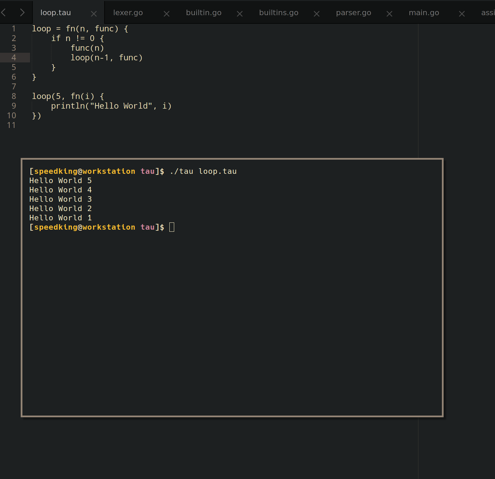
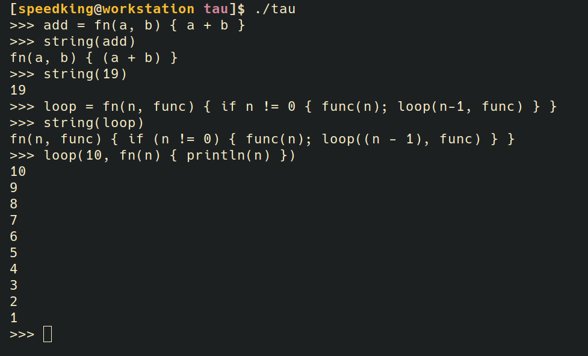

# τ

Tau is a dinamically-typed open source programming language designed to be minimal, fast and efficient.

## Syntax

### Installation
In order to install Tau you need to have the go compiler installed or otherwhise you can get it from .

Once done, running the following command will successfully install the tau interpreter:
```bash
go get github.com/NicoNex/tau
```

### Hello World
We all start from here...
```
println("Hello World")
```

### Examples of syntax

#### File


#### if-else blocks

```
if 1 > 0 {
	println("yes")
} else {
	println("no")
}
```

```
myVar = 10

if myVar > 10 {
	println("more than 10")
} else if myVar == 10 {
	println("it's exactly 10")
} else {
	println(myVar)
}
```

#### Declaring a function
```
loop = fn(times, function) {
	if times != 0 {
		function()
		loop(times-1, function)
	}
}

loop(5, fn() { println("Hello World") })
```

#### Noteworthy features
The return value can be implicit:
```
add = fn(x, y) { x + y }
sum = add(9, 1)
println(sum)
10
```

Also you can inline the if expressions:
```
a = 0
b = 1

minimum = if a < b { a } else { b }
```

The semicolon character `;` is implicit on a newline but can be used to separate multiple expressions on a single line.
```
printData = fn(a, b, c) { println(a); println(b); println(c) }
```

Functions are first-class and treated as any other data type.
```
get_minumum = fn(a, b) {
	if a < b {
		return a
	}
	b
}

var1 = 1
var2 = 2

min = get_minimum(var1, var2)
println(min)

>>> 1
```

##### REPL
Tau also supports a REPL:


### Data types
Tau is a dynamically-typed programming language and it supports the following primitive types:

#### Integer
```
my_var = 10
```

#### Float
```
my_var = 2.5
```

#### String
```
str = "My string here"
```

#### Boolean
```
t = true
f = false
```

#### Function
```
pow = fn(base, exponent) {
	if exponent > 0 {
		return base * pow(base, exponent-1)
	}
	1 # You could optionally write 'return 1', but in this case the return is implicit.
}
```

#### List
```
empty = []
stuff = ["Hello World", 1, 2, 3, true]
```

#### Dictionary
Coming soon...
